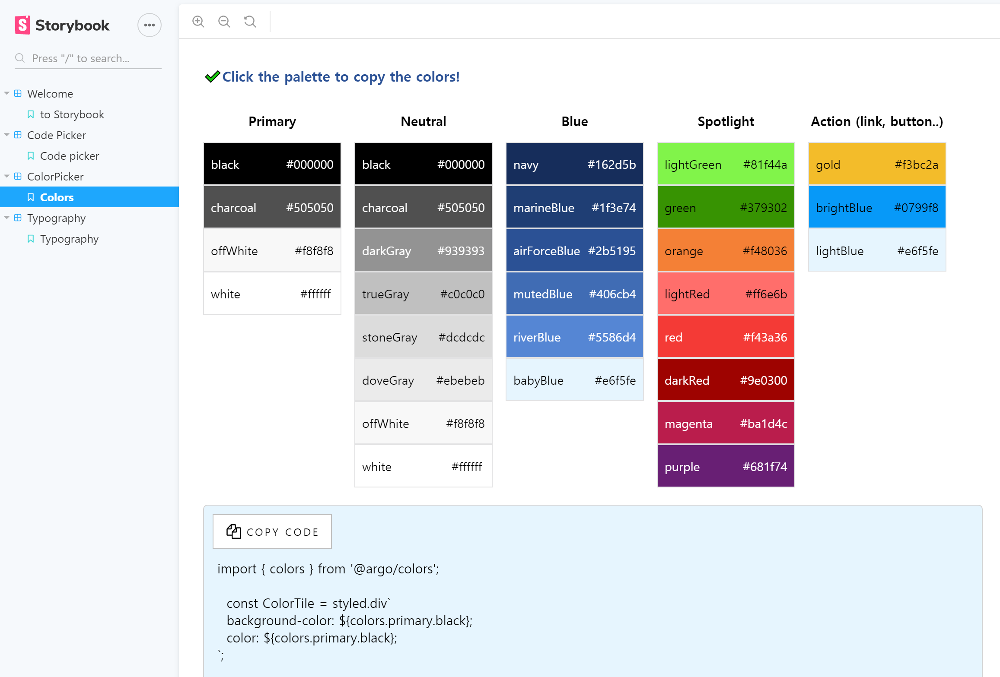

## UI storybook 

- Storybook is a user interface development environment and playground for UI components. 
The tool enables developers to create components independently and showcase components interactively in an isolated development environment.

- A Storybook is a collection of stories. Each story represents a single visual state of a component.

#### `npm run storybook` to open Storybook
#### [Live Demo](https://uistorybook.netlify.com/?path=/story/color-picker--color-palette)

